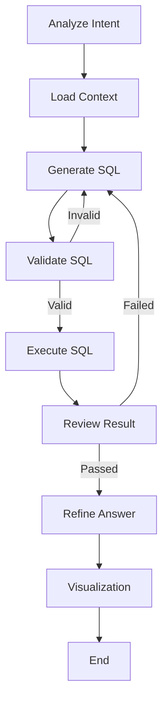

# Nl_tosql_agent

**Nl_tosql_agent** 是一个智能的自然语言转 SQL (NL-to-SQL) 代理，旨在帮助用户通过自然语言查询 Excel 或 PostgreSQL 数据库。它基于 LangGraph 构建了一个多步骤的工作流，能够理解用户意图、生成 SQL、验证 SQL、执行查询、审查结果，并最终生成自然语言回答和可视化图表建议。

## ✨ 核心特性

*   **多源支持**: 支持 Excel 文件和 PostgreSQL 数据库作为数据源。
*   **智能工作流**: 基于 LangGraph 的有向无环图 (DAG) 工作流，包含以下节点：
    *   **Intent Analysis**: 分析用户意图，识别涉及的表、字段和查询类型。
    *   **Load Context**: 加载相关的数据源上下文和 Schema 信息。
    *   **SQL Generation**: 基于意图和上下文生成符合方言的 SQL 查询。
    *   **SQL Validation**: 检查生成的 SQL 语法和逻辑有效性。
    *   **Execute SQL**: 在数据源上执行经过验证的 SQL。
    *   **Result Review**: 审查执行结果是否回答了用户问题。
    *   **Refine Answer**: 将查询结果转化为通俗易懂的自然语言回答。
    *   **Visualization**: (新增) 根据查询结果自动生成合适的可视化图表配置。
*   **本地 LLM 支持**: 兼容 OpenAI 接口格式的本地 LLM (如通过 LM Studio 运行的 Qwen2.5)。
*   **技能 (Skills) 系统**: 支持扩展业务逻辑和领域知识。

## 🏗️ 架构概览

系统采用模块化设计，核心工作流如下：



## 🚀 快速开始

### 前置要求

*   Python 3.9+
*   PostgreSQL (可选，如使用 Excel 模式则不需要)
*   本地 LLM 服务 (推荐 LM Studio) 或 OpenAI API Key

### 安装步骤

1.  **克隆仓库**
    ```bash
    git clone https://github.com/yjzaaa/Nl_tosql_agent.git
    cd Nl_tosql_agent
    ```

2.  **安装依赖**
    ```bash
    # 使用 uv (推荐)
    uv pip install -r requirements.txt
    
    # 或者使用 pip
    pip install -r requirements.txt
    ```

3.  **配置环境**
    复制 `.env.example` (如果存在) 或创建一个新的 `.env` 文件：
    ```ini
    # .env
    
    # LLM 配置 (示例: 本地 LM Studio)
    OPENAI_API_KEY=lm-studio
    OPENAI_API_BASE=http://localhost:1234/v1
    LLM_MODEL=qwen2.5-1.5b-instruct
    
    # 数据源配置 (PostgreSQL)
    DB_HOST=localhost
    DB_PORT=5432
    DB_NAME=postgres
    DB_USER=postgres
    DB_PASSWORD=yourpassword
    ```

    同时检查 `config/config.yaml` 或 `config/config_postgres.yaml` 进行更详细的配置。

### 使用方法

#### 1. 命令行交互模式 (CLI)
启动交互式会话，直接与 Agent 对话：
```bash
python src/main.py --cli
```

#### 2. 单次查询
直接执行单条查询语句：
```bash
python src/main.py --query "Show me top 5 cost centers by budget"
```

#### 3. 列出可用技能
查看当前加载的技能列表：
```bash
python src/main.py --list-skills
```

## 📂 项目结构

```
src/
├── agents/             # 各个功能 Agent 的实现 (Intent, SQL Gen, Validation, etc.)
├── config/             # 配置文件和日志配置
├── core/               # 核心逻辑
│   ├── data_sources/   # 数据源适配器 (Excel, Postgres)
│   └── loader/         # 数据加载器
├── graph/              # LangGraph 工作流定义
├── prompts/            # Prompt 模板管理
├── skills/             # 业务技能和检索逻辑
├── tools/              # 工具函数
├── workflow/           # 工作流编排
├── main.py             # 程序入口
└── nl_to_sql_agent.py  # Agent 封装类
```

## 🛠️ 开发与测试

运行测试套件：
```bash
# 运行所有测试
pytest

# 运行特定测试
python tests/debug_workflow.py
```

## 📝 License

[MIT License](LICENSE)
