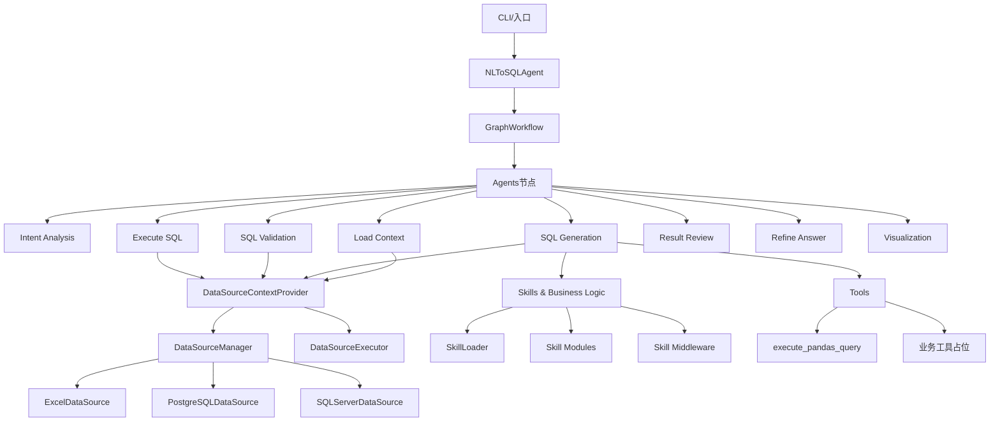
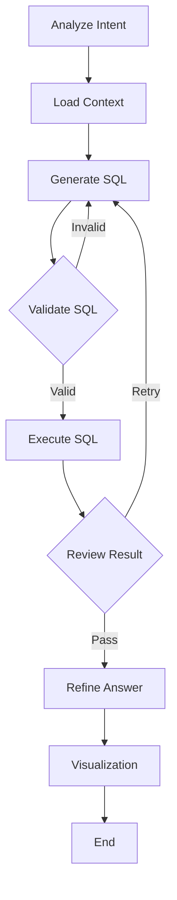

# 项目架构与模块业务逻辑

> 适用日期：2026年2月3日

## 1. 架构概览

本项目是一个基于 LangGraph 的 NL-to-SQL 智能代理系统，核心由“工作流编排 + Agent 节点 + 数据源上下文 + Skill 业务知识 + 工具调用”组成。整体目标是将自然语言问题转化为安全可执行的查询或工具调用，并输出自然语言答案与可视化建议。

## 2. 组件架构图（模块层）

## 3. 工作流架构图（执行流）

## 4. 功能模块与业务逻辑

### 4.1 入口与顶层编排

- **主入口**：负责命令行参数解析、技能选择与执行方式控制。
  - 关键文件：[src/main.py](../src/main.py)
- **NLToSQLAgent 封装**：构建初始状态并调用图工作流执行；统一返回结果结构。
  - 关键文件：[src/nl_to_sql_agent.py](../src/nl_to_sql_agent.py)

**业务逻辑要点**：

1. 支持 `--skill` 与 `--skill-path` 指定业务技能。
2. 允许单次查询与交互式 CLI。
3. 通过 `GraphWorkflow` 完成完整的多阶段处理。

---

### 4.2 GraphWorkflow 工作流引擎

- **职责**：定义节点、边与重试路径；维护状态类型 `AgentState`。
  - 关键文件：[src/graph/graph.py](../src/graph/graph.py)

**业务逻辑要点**：

1. 起点为 `analyze_intent`。
2. `validate_sql`、`execute_sql`、`review_result` 具有条件分支与重试逻辑。
3. 最终输出包含 `execution_result` 与 `chart_config`。

---

### 4.3 Agent 节点职责

#### 4.3.1 意图分析（Intent Analysis）

- **文件**：[src/agents/intent_analysis_agent.py](../src/agents/intent_analysis_agent.py)
- **逻辑**：
  1. 从消息或 `user_query` 取回用户问题。
  2. 结合 Skill 元数据与 `resolve_table_names()` 初步识别表。
  3. 调用 LLM，输出结构化意图分析 JSON。

#### 4.3.2 上下文加载（Load Context）

- **文件**：[src/agents/load_context_agent.py](../src/agents/load_context_agent.py)
- **逻辑**：
  1. 初始化 `trace_id` 与 `retry_count`。
  2. 基于用户问题解析表名。
  3. 通过 `DataSourceContextProvider` 检测数据源。

#### 4.3.3 SQL 生成（SQL Generation）

- **文件**：[src/agents/sql_generation_agent.py](../src/agents/sql_generation_agent.py)
- **逻辑**：
  1. 从上下文提供者获取数据库/Excel 的 schema 与 SQL 规则。
  2. 拼装 Prompt 并调用 LLM。
  3. 支持工具调用模式：执行类工具（`execute_pandas_query` 等）会被序列化为 JSON 计划，交给执行节点运行。

#### 4.3.4 SQL 校验（SQL Validation）

- **文件**：[src/agents/sql_validation_agent.py](../src/agents/sql_validation_agent.py)
- **逻辑**：
  1. 阻止危险关键字（写操作、系统调用等）。
  2. Excel 模式直接视为通过。
  3. SQL 模式通过 LLM 验证 schema 与语法一致性，并根据数据源类型注入规则。

#### 4.3.5 SQL 执行（Execute SQL）

- **文件**：[src/agents/execute_sql_agent.py](../src/agents/execute_sql_agent.py)
- **逻辑**：
  1. 如果 `sql_query` 是工具调用 JSON，则匹配 `ALL_TOOLS` 并执行。
  2. 否则通过 `DataSourceContextProvider.execute_sql()` 执行 SQL。
  3. 结果保存在 `execution_result` 与 `execution_data`。

#### 4.3.6 结果审查（Result Review）

- **文件**：[src/agents/result_review_agent.py](../src/agents/result_review_agent.py)
- **逻辑**：
  1. LLM 判断结果是否能回答问题。
  2. PASS → 进入答案生成；RETRY → 触发回退。

#### 4.3.7 答案生成（Refine Answer）

- **文件**：[src/agents/refine_answer_agent.py](../src/agents/refine_answer_agent.py)
- **逻辑**：
  1. 将 SQL 与结果转写为自然语言。
  2. 若结果含错误，强制仅输出错误解释。

#### 4.3.8 可视化建议（Visualization）

- **文件**：[src/agents/visualization_agent.py](../src/agents/visualization_agent.py)
- **逻辑**：
  1. 取 `execution_data` 前 5 行。
  2. 生成图表类型与配置 JSON。
  3. 不阻断主流程，失败仅输出 error。

---

### 4.4 数据源与上下文系统

#### 4.4.1 数据源上下文提供者

- **文件**：[src/core/data_sources/context_provider.py](../src/core/data_sources/context_provider.py)
- **逻辑**：
  1. 统一入口，封装 Loader / Manager / Executor。
  2. 优先注入 Skill 业务逻辑，再注入 schema。
  3. Excel 模式自动降级为 SQLite 规则。

#### 4.4.2 数据源管理与执行

- **管理器**：[src/core/data_sources/manager.py](../src/core/data_sources/manager.py)
- **执行器**：[src/core/data_sources/executor.py](../src/core/data_sources/executor.py)

**业务逻辑要点**：

1. 管理器负责选择 Excel/PostgreSQL/SQL Server 策略。
2. 执行器统一执行接口，支持从 `AgentState` 解析 SQL 与数据源类型。

#### 4.4.3 数据源策略

- **Excel**：[src/core/data_sources/excel_source.py](../src/core/data_sources/excel_source.py)
- **PostgreSQL**：[src/core/data_sources/postgres_source.py](../src/core/data_sources/postgres_source.py)
- **SQL Server**：[src/core/data_sources/sqlserver_source.py](../src/core/data_sources/sqlserver_source.py)

**业务逻辑要点**：

1. Excel 通过 SQLite 内存库执行查询，并自动加载多表。
2. PostgreSQL/SQL Server 通过 SQLAlchemy 连接与 schema 读取。

---

### 4.5 Skills 业务能力体系

- **加载器**：[src/skills/loader.py](../src/skills/loader.py)
- **中间件**：[src/skills/middleware/skill_middleware.py](../src/skills/middleware/skill_middleware.py)
- **技能目录示例**：[skills/cost_allocation/SKILL.md](../skills/cost_allocation/SKILL.md)

**业务逻辑要点**：

1. Skill 通过 `SKILL.md` + `references/*.md` 组织业务知识。
2. 业务上下文通过 Skill 中间件注入，SQL 生成阶段不再额外检索工具。
3. 元数据可驱动表映射与默认表选择。

---

### 4.6 Prompts 模板系统

- **管理器**：[src/prompts/manager.py](../src/prompts/manager.py)
- **模板文件**：[src/prompts/templates](../src/prompts/templates)

**业务逻辑要点**：

1. 提供 Intent、SQL 生成、SQL 校验、结果审查、答案生成模板。
2. 模板为中文且与业务解耦，业务信息仅通过 Skill 上下文注入。
3. 统一的 `render_prompt_template()` 进行变量注入。

---

### 4.7 工具系统

- **工具实现**：[src/tools/common.py](../src/tools/common.py)

**业务逻辑要点**：

1. 提供 SQL 执行类与业务分析占位工具。
2. 允许在 SQL 生成阶段被 LLM 调用，最终在执行阶段运行。

---

## 5. 典型业务处理流程（文字版）

1. 用户输入自然语言问题。
2. 意图分析：识别查询目标与可能表。
3. 上下文加载：根据表名与 Skill 提供 schema 与业务规则。
4. SQL 生成：输出 SQL 或工具调用 JSON。
5. SQL 校验：拦截不安全语句并校验 schema。
6. SQL 执行：在 Excel/数据库执行或调用业务工具。
7. 结果审查：判断是否命中需求，必要时重试。
8. 答案生成：输出自然语言回答。
9. 可视化建议：生成图表类型与配置（可选）。

### 4.8 LLM 模块

- **核心实现**：[src/core/llm.py](../src/core/llm.py)

**业务逻辑要点**：

1. 提供 OpenAI/Azure OpenAI 的统一调用与回调注入。
2. 各 Agent 通过 `get_llm()` 获取实例。

## 6. 备注

- 本文档基于当前代码结构生成，后续新增 Agent 或数据源需补充流程与模块说明。
