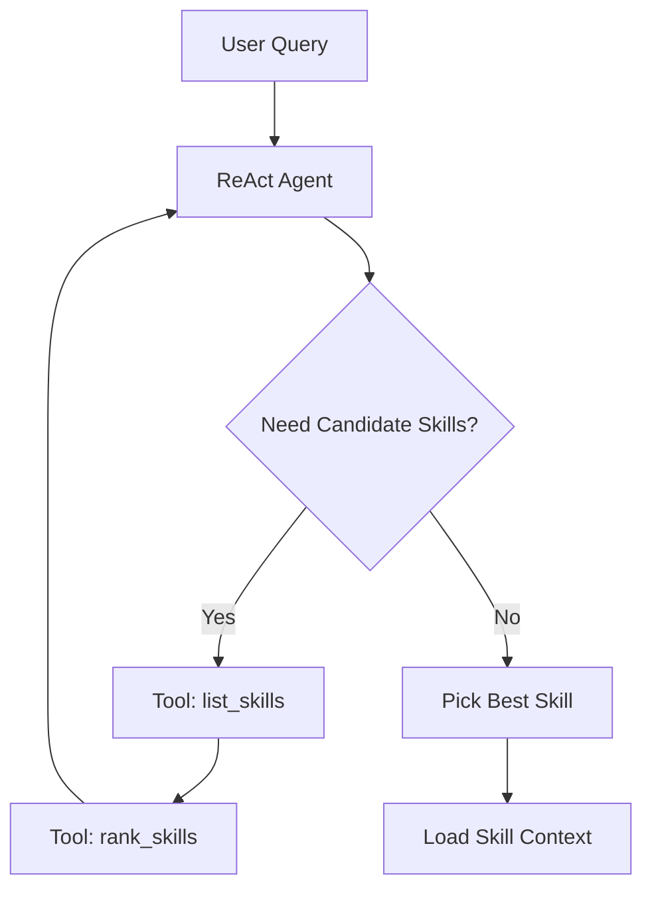

# Skill 中间件（LangChain 中间件框架 + ReAct）设计文档

> 适用日期：2026年2月3日

## 1. 背景与目标

当前系统通过 `--skill` 显式选择技能。需要引入一个“Skill 中间件”，在工作流入口自动根据用户问题选择最匹配的 Skill，并将该 Skill 的详细信息加载到工作流上下文中，供后续 SQL 生成、校验、执行与回答使用。

**目标**：

1. 使用 LangChain 的中间件/可组合链（Runnable/Callback）框架设计。（相关的官网资源https://reference.langchain.org.cn/python/langchain/middleware/)
2. 使用 ReAct agent 模式完成技能检索与选择。
3. 基于各个 Skill 的 `SKILL.md` 中的 `name` 与 `description` 做相似度匹配。
4. 将最匹配 Skill 的完整信息（元数据 + 模块内容 + references）写入工作流上下文。

## 2. 设计范围

- 自动发现 `skills/**/SKILL.md` 文件。
- 基于 `name`/`description` 构建候选集。
- ReAct Agent 迭代决策选择最佳 Skill。
- 将 Skill 信息注入 `AgentState`（或新增 `skill_context` 字段）。

**不包含**：

- 具体数据库/Excel 连接逻辑变更。
- SQL 生成规则的改写（仍复用现有规则）。

## 3. 架构概览

```mermaid
graph TD
    A[User Query] --> B[Skill Middleware (ReAct)]
    B --> C[Skill Index: name/description]
    B --> D[Similarity Scoring]
    B --> E[Skill Loader]
    E --> F[Skill Context]
    F --> G[GraphWorkflow Initial State]
```

## 4. 数据模型

### 4.1 SkillSummary

```json
{
  "name": "cost_allocation",
  "description": "IT功能成本分摊业务逻辑与规则，用于成本分摊、预算/实际对比与趋势分析。",
  "version": "2.3.0",
  "path": "skills/cost_allocation",
  "license": "Private"
}
```

### 4.2 SkillContext

```json
{
  "skill": {
    "name": "cost_allocation",
    "version": "2.3.0",
    "description": "...",
    "license": "Private"
  },
  "modules": {
    "metadata": "<content>",
    "business_rules": "<content>",
    "sql_examples_basic": "<content>"
  },
  "config": { "...": "..." }
}
```

### 4.3 AgentState 扩展

新增字段（建议）：

- `skill_context: Optional[Dict[str, Any]]`
- `skill_selected_by: Optional[str]`（记录选择方式，便于审计，如 `react_agent`）

## 5. 中间件设计（LangChain）

### 5.1 中间件组件

1. **SkillCatalogLoader**
   - 读取 `skills/**/SKILL.md`。
   - 解析 `name`/`description`/`version`/`license`。
   - 输出 `List[SkillSummary]`。

2. **SkillSimilarityTool**（工具）
   - 输入：用户问题 + SkillSummary 列表
   - 输出：候选排序（可基于向量相似度或 BM25 + 规则）

3. **SkillSelectorReActAgent**
   - ReAct 思维链：
     - 观察用户问题
     - 检索候选 Skill
     - 评估与决策
   - 产出：最佳 Skill 名称 + 置信度

4. **SkillContextLoader**
   - 调用 `SkillLoader` 加载完整 Skill
   - 读取 references/\*.md
   - 形成 `SkillContext`

5. **SkillMiddlewareRunnable**
   - 实现 LangChain Runnable 规范
   - 在工作流入口运行，将 `skill_context` 写入 `AgentState`

---

## 6. ReAct 模式交互流程



**ReAct 输出约束**：

- 必须返回：`skill_name`, `confidence`, `reasoning_summary`。
- 当 `confidence < 0.4` 时，fallback 至默认 skill（如 `nl-to-sql-agent`）。

## 7. 与现有工作流集成

### 7.1 入口扩展

- 在 `NLToSQLAgent.query()` 初始化 state 前，先执行 SkillMiddleware。
- 将返回的 `skill` 与 `skill_context` 注入 state。

### 7.2 状态使用

- `intent_analysis_agent` 使用 `skill_context` 的元数据。
- `sql_generation_agent` 注入业务规则与 SQL 规则。
- `data_source_context_provider` 使用 `skill` 加载业务逻辑。

## 8. Prompt 设计建议

### 8.1 ReAct 系统提示词（摘要）

- 输入用户问题。
- 允许使用工具 `list_skills` 与 `rank_skills`。
- 输出必须包含 `skill_name` 与 `confidence`。

## 9. 失败与回退策略

1. 无技能命中：回退默认 skill。
2. 置信度低：标记 `skill_selected_by="fallback"`。
3. 中间件异常：不影响主流程，进入默认 skill。

## 10. 影响范围

- 新增中间件模块（建议路径）：
  - `src/skills/middleware/skill_middleware.py`
- 修改：
  - `src/nl_to_sql_agent.py`（接入中间件）
  - `src/graph/graph.py`（增加 `skill_context`）

## 11. 验收标准

1. 输入用户问题时，可自动选择匹配的 Skill。
2. 选择逻辑可解释（提供 reason）。
3. Skill 详细信息可在后续节点读取。
4. 无 Skill 时不影响主流程执行。

## 12. 附录：匹配样例

- Query: “预算 vs 实际对比，IT Allocation 近3个月趋势”
- Skill: `cost_allocation`（description 命中预算/实际/趋势分析）
